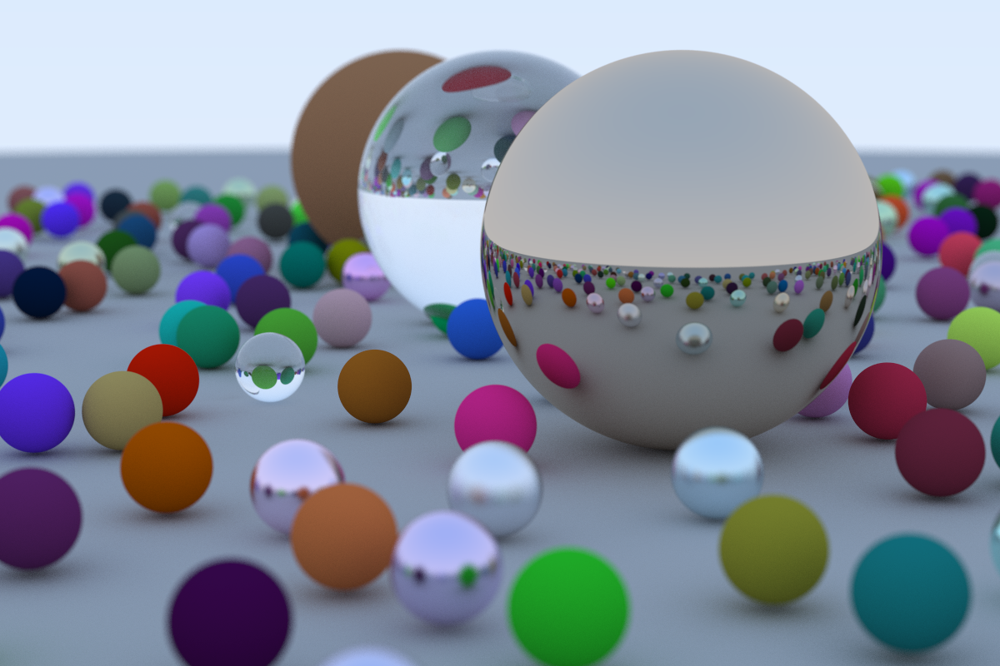

# "Ray Tracing in One Weekend" in Rust

Rust implementation of ["Ray Tracing in One Weekend"](https://raytracing.github.io/books/RayTracingInOneWeekend.html). All rendering is done on the CPU (using rayon internally), and will use all available cores.

## Get the code and run things

``` sh
git clone https://github.com/walecome/rtrs.git
cd rtrs
cargo run # Use `--release` for faster renders
```
## Usage:

``` sh
Usage: rtrs [OPTIONS]

Options:
      --samples-per-pixel <SAMPLES_PER_PIXEL>  [default: 500]
      --max-depth <MAX_DEPTH>                  [default: 50]
  -h, --help                                   Print help
```

Output image is written to `/tmp/image.png`:

